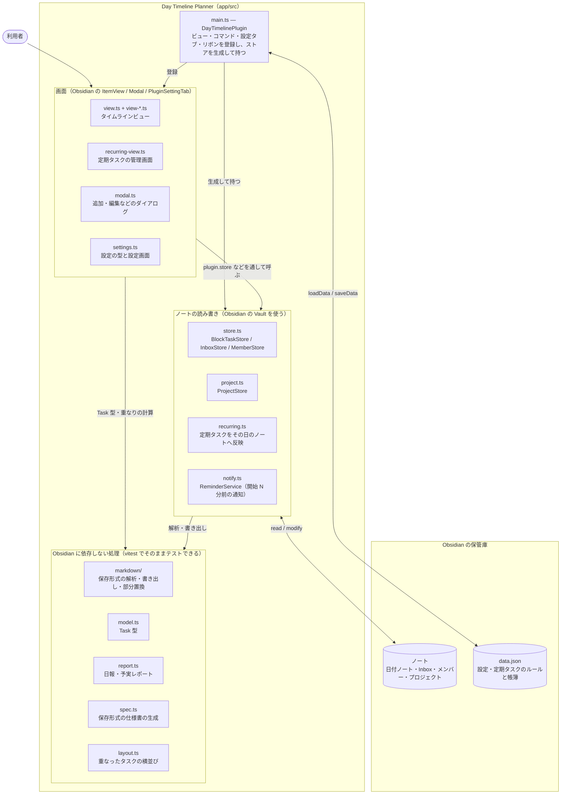
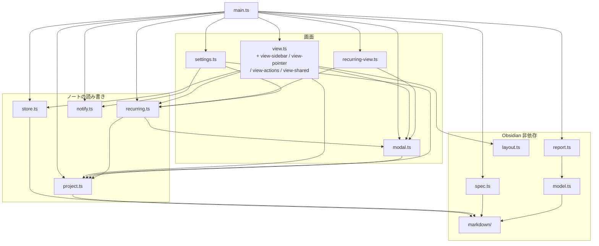
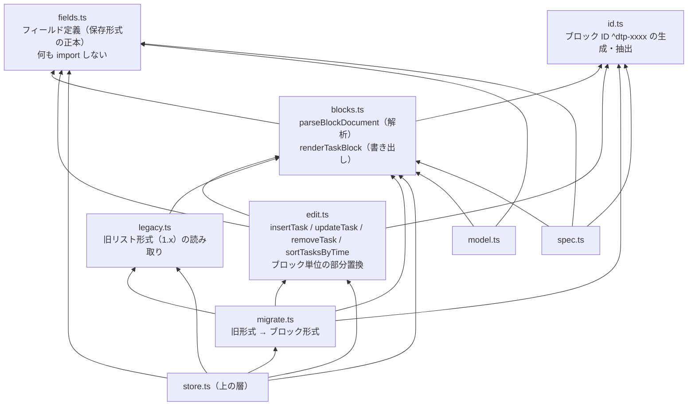
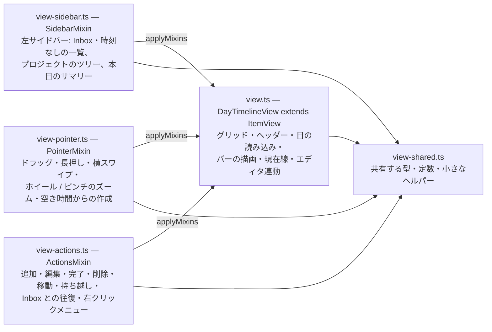
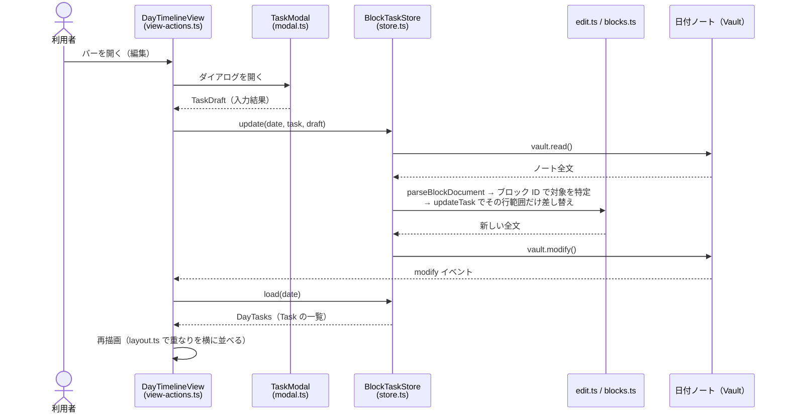
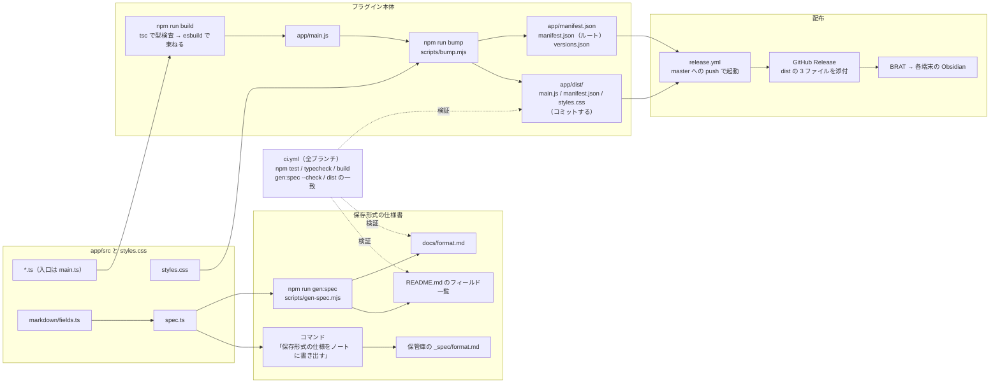

# プラグインの構成図

Day Timeline Planner（`app/src/`）の構成を図で示す。各ファイルの役割の一覧は README の「ソースからビルドする」、
変更するときの約束は `CLAUDE.md` にある。この文書は「どこに何があり、何が何を使うか」を一目で掴むためのもので、
図の根拠は各ファイルの `import`。ファイルを足したり依存の向きを変えたときは、この文書も直す。

図は Mermaid で書いてある（GitHub と Obsidian がそのまま描画する）。

## 1. 全体像

Obsidian の上に、入口（`main.ts`）・画面・ノートの読み書き・Obsidian に依存しない処理の 4 段が乗る。
下の段ほど Obsidian から遠く、`markdown/` と `model.ts` などは Obsidian 無しでそのままテストできる。

## 2. モジュール間の依存（import の向き）

矢印は「使う → 使われる」。図を読めるように、次の矢印は省いてある（正確な一覧はすぐ下の表）。

- `util.ts` / `icons.ts` / `dropdown.ts`（どこからでも使う小道具）への矢印
- `settings.ts`（設定の型）・`model.ts`（Task 型）・`markdown/`（ブロックの解析）への矢印のうち、型や解析だけを借りているもの。
  `markdown/` への矢印は、保存形式を直接読み書きするものだけ残した

`view` / `recurring-view` / `settings` / `recurring` / `notify` は `main.ts` を `import type` で参照している（`plugin` の型を受け取るため）。
型だけの参照で実行時の循環は無いので、図には描かず表に「main（型）」と書いた。

読み方のポイント:

- **`main.ts` だけが全部を知っている。** ビュー・ダイアログ・ストアはお互いを直接 new せず、`plugin.store` / `plugin.projects` のように本体経由で辿る
- **`markdown/` と `model.ts` は下向きにしか依存しない。** 保存形式の変更はここで完結し、上の層は `Task` 型を通して結果を受け取る
- **`settings.ts` は型と既定値の置き場でもある。** ストアやプロジェクトが `settings` を参照するのは、フォルダ名や日付形式など設定値を読むため

ファイルごとの import の一覧（`obsidian` / `util` / `icons` / `dropdown` は除く。「型」は `import type` だけ）:

| ファイル | 使うもの |
| --- | --- |
| `main.ts` | view, recurring-view, modal, settings, store, project, recurring, notify, report, spec, model, markdown/blocks, markdown/id |
| `view.ts` | view-sidebar, view-pointer, view-actions, view-shared, layout, store, project, recurring, settings, model, main（型） |
| `view-sidebar.ts` | view-shared, modal, store, project, settings, model, markdown/blocks, view（型） |
| `view-pointer.ts` | view-shared, settings, model, view（型） |
| `view-actions.ts` | view-shared, modal, store, project, recurring, model, markdown/blocks, markdown/id, view（型） |
| `view-shared.ts` | settings, model, markdown/blocks |
| `recurring-view.ts` | modal, recurring, settings, main（型） |
| `modal.ts` | project, settings, model, markdown/blocks |
| `settings.ts` | notify, project, recurring, main（型） |
| `store.ts` | settings, model, markdown/blocks, markdown/edit, markdown/fields, markdown/legacy, markdown/migrate |
| `project.ts` | settings, model, markdown/blocks, markdown/id |
| `recurring.ts` | modal, project, settings, model, markdown/blocks, markdown/id, main（型） |
| `notify.ts` | model, main（型） |
| `report.ts` | model |
| `spec.ts` | markdown/blocks, markdown/fields, markdown/id |
| `model.ts` | markdown/blocks, markdown/fields |
| `layout.ts` / `util.ts` / `markdown/fields.ts` / `markdown/id.ts` | （何も import しない） |
| `markdown/` の残り | 図 3 |

## 3. 保存形式層（markdown/）

`fields.ts` が正本。ブロック（見出し + メタ行 + フィールド行 + 本文）の解析と書き出しは `blocks.ts`、
ノートの書き換えは `edit.ts` が「全文を解析し直す → ブロック ID で対象を見つける → その行範囲だけ差し替える」手順で行う。
`legacy.ts` / `migrate.ts` は 1.x のリスト形式を変換するためだけに残っている。

## 4. タイムラインビューの合成（ミックスイン）

`view.ts` の `DayTimelineView` は 1 つのクラスだが、責務ごとに 3 つのファイルへ分け、末尾で `applyMixins` により合成している。
各ミックスインの中では `this` がビュー自身。ビューのファイル同士は互いに import せず、共有する型・定数は `view-shared.ts` に置く。

## 5. タスクを書き換えるときの流れ

ノートへの書き込みはビューでは `view-actions.ts` を通り、ストアが `edit.ts` でブロック単位に差し替える。
ビューは行番号を覚えず、Vault の `modify` イベントを受けて読み直すので、利用者がノートを直接編集していても壊れない。

定期タスクは、ビューがその日を表示するときに `recurring.ts` の `applyRecurring` を呼び、
まだ入っていない発生日のタスクを同じストア経由でノートに書く。反映の帳簿（どの日に入れたか・取り消し・個別調整）は
ノートではなく設定（`data.json`）側に持つ。

## 6. データの置き場

| 持ち主 | 置き場（既定） | 中身 |
| --- | --- | --- |
| `BlockTaskStore`（store.ts） | `Timeline/YYYY-MM-DD.md`（フォルダ・日付形式は設定） | その日のタスクブロック |
| `InboxStore`（store.ts） | `Timeline/Inbox.md` | 日付を決めていないタスク |
| `MemberStore`（store.ts） | `Timeline/Members/<名前>/YYYY-MM-DD.md`（メンバーごとに変更可） | 他の人の予定 |
| `ProjectStore`（project.ts） | `Timeline/Projects/`（設定で変更可） | プロジェクトノート（1 プロジェクト = 1 ノート） |
| 削除ログ（store.ts） | `Timeline/Log.md` | 削除したタスクの記録 |
| `DayTimelinePlugin`（main.ts） | `.obsidian/plugins/<プラグイン>/data.json` | 設定、メンバー、定期タスクのルールと発生日ごとの帳簿 |
| 仕様書の書き出し（spec.ts） | `Timeline/_spec/format.md` | 保管庫の設定を埋めた保存形式の仕様（AI 向け） |

## 7. ビルド・生成物・リリース

ソースからは 2 系統の生成物ができる。プラグイン本体（`main.js` → `dist/`）と、保存形式の仕様書（`docs/format.md` と README の一覧）。
どちらも CI が「ソースと一致しているか」を検証する。

## 8. テストの対応

`app/test/` は vitest。`obsidian-stub.ts` が `obsidian` モジュールの代わりになり、`fake-vault.ts` が Vault を模す。
`fixtures/*.md` は保存形式の実例で、README の説明と一致させる。

| テスト | 対象 |
| --- | --- |
| `blocks.test.ts` / `fields.test.ts` | `markdown/blocks` `markdown/fields`（解析と書き出しの往復、全フィールドの読み取り） |
| `edit.test.ts` | `markdown/edit`（ブロック単位の部分置換） |
| `migrate.test.ts` | `markdown/migrate`（旧形式からの変換） |
| `spec.test.ts` | `spec`（仕様書が全フィールドを含むこと） |
| `store.test.ts` / `project.test.ts` | `store` `project`（fake-vault 上での読み書き） |
| `recurring.test.ts` | `recurring`（発生日の反映・取り消し・個別調整） |
| `settings.test.ts` | `settings`（設定の版の移行） |
| `view-mixins.test.ts` / `view-shared.test.ts` | `view` の合成、`view-shared` のヘルパー |
